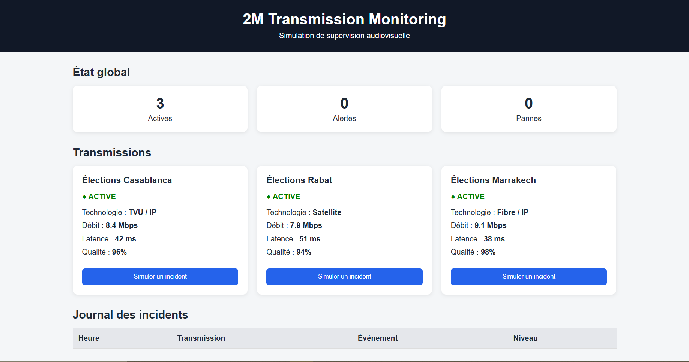
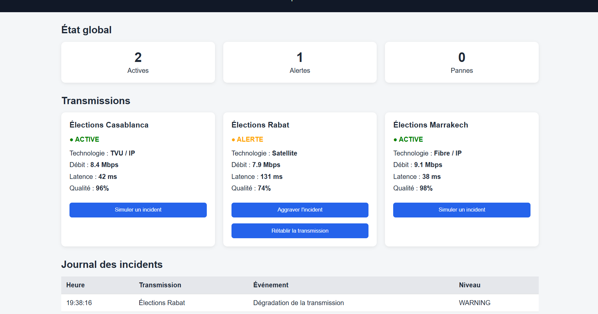
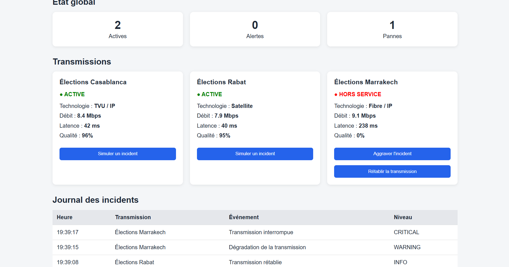

# 2M Transmission Monitoring

## 📡 Description

2M Transmission Monitoring est une application web développée dans le cadre d'un projet personnel inspiré d'une expérience de stage dans le domaine de la transmission audiovisuelle.

L'objectif du projet est de simuler un tableau de bord permettant de superviser plusieurs flux de transmission lors d'un événement audiovisuel.

L'application permet notamment de suivre l'état des transmissions, leur qualité, leur latence et leur débit, ainsi que de simuler différents incidents.

> ⚠️ Ce projet est une simulation pédagogique et ne représente pas l'infrastructure réelle de 2M.

# 🖥️ Aperçu


## ⚠️ Simulation d'incident


## 🖥️ Restauration


---


## 🎯 Objectifs

- Comprendre les principes de base de la supervision d'une transmission audiovisuelle.
- Visualiser différents indicateurs de performance.
- Simuler des dégradations et interruptions de transmission.
- Enregistrer les incidents dans un journal de supervision.
- Mettre en pratique les technologies web étudiées durant ma formation.

---

## ⚙️ Fonctionnalités

- 📊 Tableau de bord de supervision
- 📡 Gestion de plusieurs transmissions
- 🟢 État des transmissions en temps réel
- 📈 Suivi du débit
- ⏱️ Suivi de la latence
- 📶 Indicateur de qualité du signal
- ⚠️ Simulation d'incidents
- 🔴 Simulation d'interruption d'une transmission
- 🔄 Rétablissement d'une transmission
- 📋 Journal des incidents

---

## 🛠️ Technologies utilisées

- HTML5
- CSS3
- JavaScript
- Git
- GitHub

---

## 🖥️ Fonctionnement

Chaque transmission possède plusieurs paramètres :

- Technologie utilisée
- Débit
- Latence
- Qualité
- État de la transmission

L'utilisateur peut simuler un incident afin d'observer la dégradation des performances d'une transmission.

Lorsqu'un incident est généré, l'événement est ajouté au journal de supervision.

---

## 🏗️ Architecture du projet

```text
2m-transmission-monitoring/
│
├── index.html       # Structure de l'application
├── style.css        # Mise en forme et interface
├── script.js        # Logique et simulation
└── README.md        # Documentation